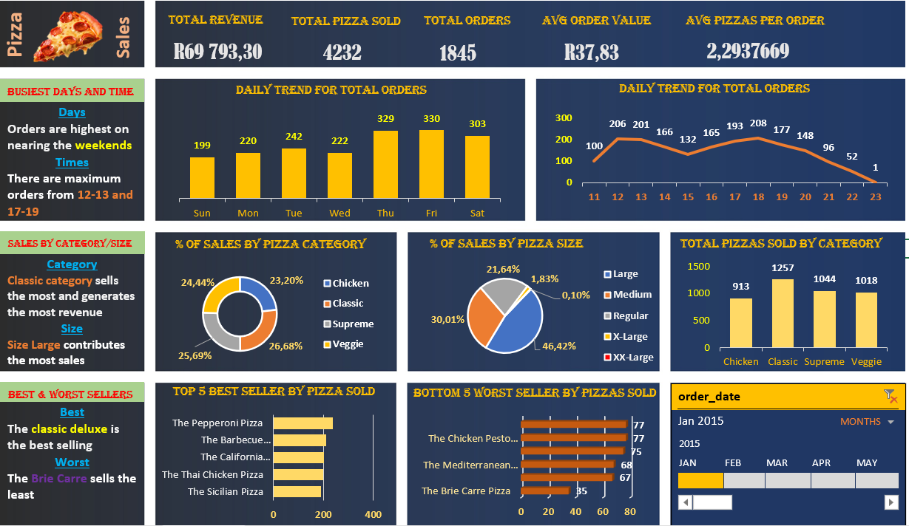
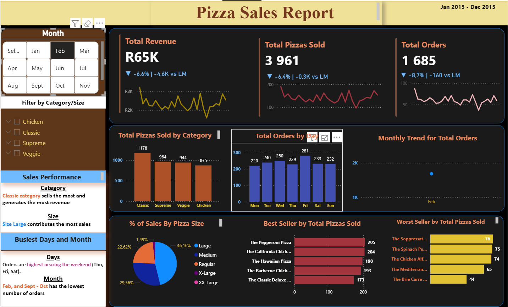

# Pizza Sales Data Analysis – SQL + Excel + Power BI

**End-to-end data project** from raw CSV to interactive dashboards.

 

---

## Project Overview

This project simulates a real-world data analysis workflow:

| Step | Tool | Description |
|------|------|-------------|
| 1. Data Cleaning | **SQL Server (SQL)** | Fixed date format errors, converted data types, validated quality |
| 2. Business Queries | **SQL Server** | 18 queries answering KPIs, peak hours, best/worst sellers |
| 3. Dashboard (Excel) | **Excel + Power Query** | Pivot tables, charts, monthly trends, category/size analysis |
| 4. Dashboard (Power BI) | **Power BI + DAX** | Interactive slicers, month-over-month measures|

---

## Data Cleaning in SQL

**Problem:** The CSV had dates in `DD-MM-YYYY` format, causing import errors.

**Solution:** Two-table staging approach:
- Import everything as `VARCHAR(MAX)`
- Use `TRY_CONVERT(DATE, order_date, 105)` and `TRY_CAST`
- Validate conversion failures (none found)
- Rename raw table as backup, clean table as production

 [View full SQL cleaning script](./sql/01_data_cleaning.sql)

---

## SQL Analytical Queries (18 total)

Examples:
- Total revenue, average order value, pizzas per order
- Peak order hours (12-13 and 17-19)
- Revenue by pizza category and size
- Top 5 and bottom 5 best-selling pizzas
- Daily and monthly trends

 [View all 18 queries](./sql/02_analysis_queries.sql)

---

## Excel Dashboard

**Tools:** Power Query, Pivot Tables, Charts

**Steps:**
1. Loaded cleaned data into Excel
2. Power Query: changed data types, added calculated columns
3. Built pivot tables for:
   - Daily & monthly order trends
   - % of sales by pizza category and size
   - Top 5 / bottom 5 pizzas by quantity sold
4. Created a single-sheet dashboard with slicers

**Key insight:** Classic category and Large size drive most revenue.

 [Download Excel file](./excel/pizza_sales_dashboard.xlsx)

---

## Power BI Dashboard

**Tools:** Power BI Desktop, DAX, Star Schema

**Data model:**
- Fact table: `pizza_sales`
- Date table (continuous calendar) linked to order date

**Some of the DAX measures created:**
- `Current Month Sales = TOTALMTD(SUM(total_price), 'Date'[Date])`
- `Previous Month Sales = CALCULATE(... PREVIOUSMONTH(...))`
- `MoM Sales =` dynamic text with ▲/▼, percent change, and absolute difference (e.g., "▲ +3.2% | +4.5K vs LM")
- Same pattern for Orders and Quantity

**Visuals:**
- KPI cards with MoM indicators
- Slicers: Month, Pizza Category, Pizza Size
- Bar charts: Top 5 / Bottom 5 pizzas
- Area chart: Monthly orders trend
- Pie chart: % of sales by size

**Interactivity:** All visuals update when filters change.

 [Download Power BI file](./powerbi/pizza_sales_dashboard.pbix)

---

## Key Business Insights

| Insight | Implication |
|---------|-------------|
| Classic category sells the most | Feature Classic pizzas in promotions |
| Large size accounts for ~46% of sales | Bundle Large with sides to increase ticket |
| Orders peak in July| Schedule extra staff, run targeted ads |
| Some pizzas ( e.g., Soppressata, Brie Carre) sell poorly | Consider menu removal |
| Busiest hours: 12-13 and 17-19 | Focus lunch/dinner marketing |

---

## Skills Demonstrated

### SQL (SQL)
- Staging tables, `TRY_CAST`/`TRY_CONVERT`, date format 105
- Aggregate functions, `GROUP BY`, `CASE`, date/time extraction
- Data validation, missing value checks

### Excel
- Power Query: data type changes, calculated columns
- Pivot tables & charts
- Dashboard layout with slicers

### Power BI
- Star schema modeling, date table
- DAX: `TOTALMTD`, `PREVIOUSMONTH`, `DIVIDE`, dynamic string formatting
- Interactive slicers, clean UI

---
